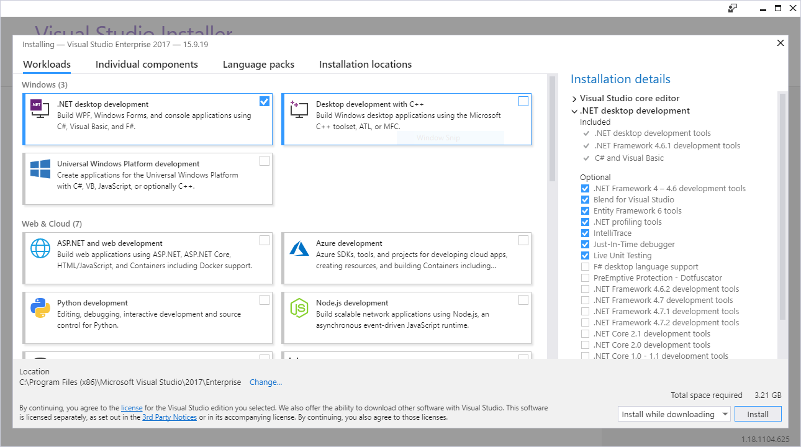
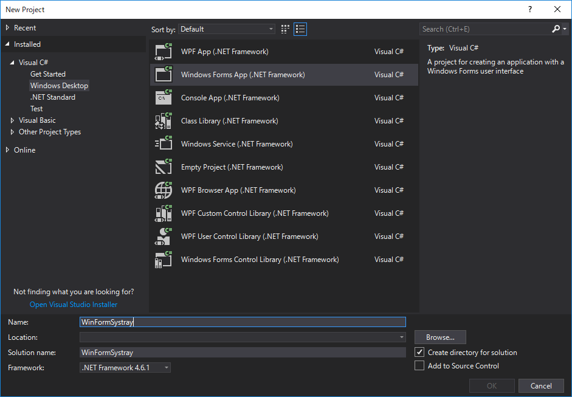
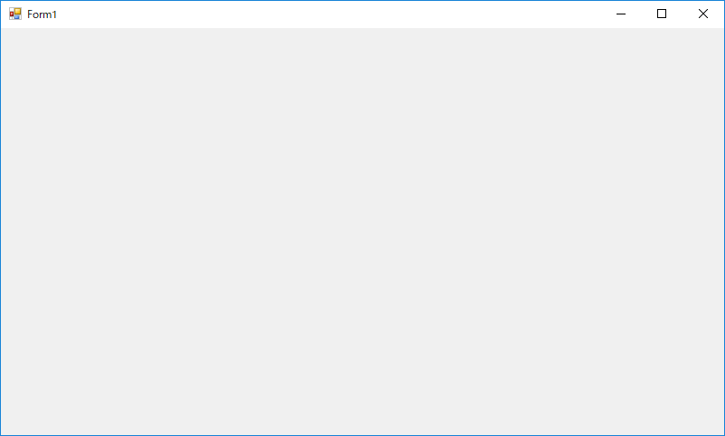
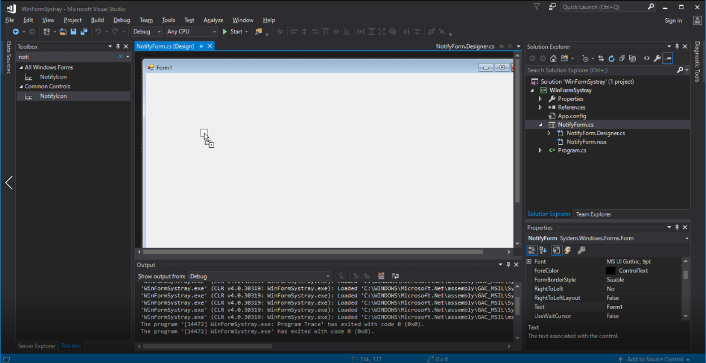
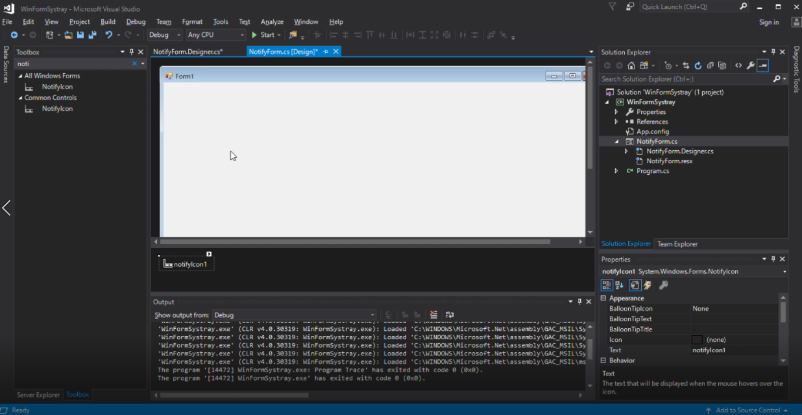
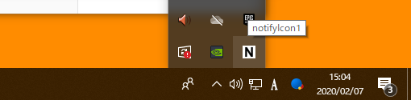
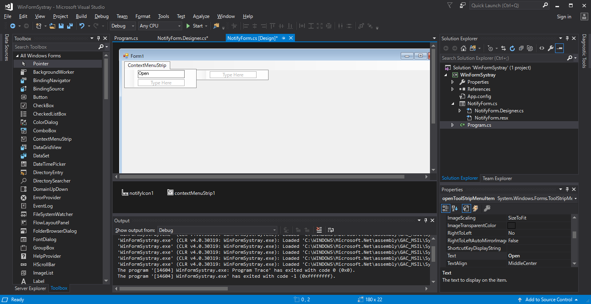
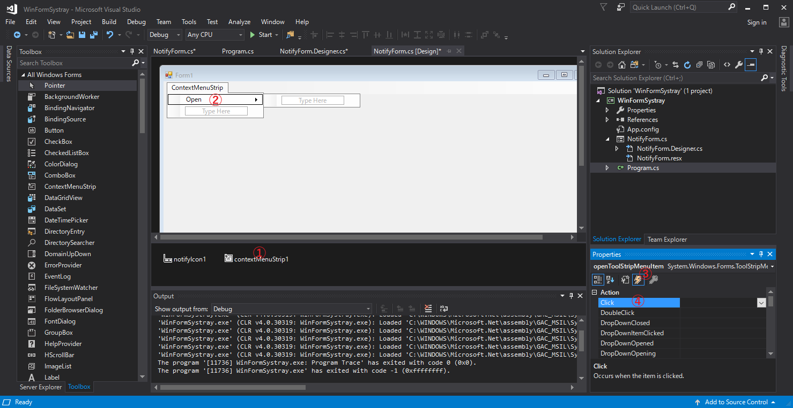
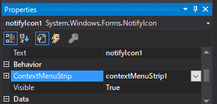

# Windows Forms App で タスクトレイアプリを作成する (Visual Studio 2017)

常駐アプリをつくる際に普段はタスクトレイにアイコンを表示しておくようなものを作りたいときがあると思います。
このようなアプリケーションについて考えてみると

- タブレットにはタスクトレイがなく、ユニバーサルアプリケーションの考え方に合わないこと
- WinForm の API からしかタスクトレイにアイコンを表示できないこと

この2つのことから既存の Windows のデスクトップしか想定しない実装になりますが、多くの常駐アプリが採用しているように利用者にとって分かりやすいことは確かです。
また、 Electron でもタスクトレイアプリを作ることができるためそちらをおすすめしますが、ここでは C# で作りたい人に向けて書きます。

---

タスクトレイという名称が Windows 以外でも使われるためここではタスクトレイという単語を使いますが、システムトレイとか通知領域という方が正しいかもしれません。

---

## 1. セットアップ

Visual Studio Installer で .Net desktop development を有効にします。



Visual Studio を開いてメニューから File >> New >> Project を選択します。
New Project のウィンドウが開かれるので Visual C# >> Windows Forms App (.NET Framework) を選択し、適当な名前 (この例では `WinFormSystray` としました ) をつけ、適当なフォルダにプロジェクトを作成します。



メニューから Debug >> Start Debugging を実行すると空のウィンドウが表示されます。



ウィンドウを閉じるか、メニューから Debug >> Stop Debugging で終了することができます。

## 2. タスクトレイにアイコンを表示する

Solution Explorer から Form1.cs を探し、適当な名前にリネームします。
ここでは `NotifyForm.cs` としました。
名前を変更すると関連するファイル名も変更するかダイアログが表示され聞かれるので `Yes` を選択します。

NotifyForm.cs を開いて Toolbox から `NotifyIcon` をドラッグアンドドロップで追加します。
これがタスクトレイに実際に追加されるアイコンの情報で、このプロパティを変更することでアイコンの画像を変えたりできます。

---

NotifyForm.cs が下の画像のようにデザインモードで開けないときは、Solution Explorer のタブからファイルを右クリックして View Designer で開くことができます。
Toolbox が見つからない場合は、メニューから View >> Toolbox で表示を切り替えることができます。

---



`NotifyIcon` を追加するとデザインビューに `NotifyIcon1` が表示されると思います。
これを選択すると右下のプロパティのタブから設定を変更することができます。



プロパティの Appearance >> Icon から適当なアイコンファイルを選択し、メニューから Debug >> Start Debugging を実行するとタスクトレイにアイコンが表示されます。



---


利用したIconファイル

---

## 3. タスクトレイのアイコンを右クリックしてウィンドウを開く

まずはプログラムの実行時に表示されるウィンドウを非表示にします。
`Program.cs` を開き変更を加えます。

```cs
using System;
using System.Collections.Generic;
using System.Linq;
using System.Threading.Tasks;
using System.Windows.Forms;

namespace WinFormSystray
{
    static class Program
    {
        private static NotifyForm notifyForm; // 1. Add form instance

        [STAThread]
        static void Main()
        {
            Application.EnableVisualStyles();
            Application.SetCompatibleTextRenderingDefault(false);
            notifyForm = new NotifyForm(); // 2. Create form and store it
            Application.Run(); // 3. Run application without visible forms
        }
    }
}
```

ここで変更したのは次の内容です。

1. フォームをメンバとして追加します
2. フォームのインスタンスを作成しメンバとして保持します
3. アプリケーションをフォームを表示せずに実行します

これを実行するとウィンドウは表示されず、タスクトレイにアイコンのみ表示されると思います。

次に `NotifyIcon1` に対し、右クリックのメニューを作成します。
NotifyForm.cs を開き `NotifyIcon` を追加したときと同じように、Toolbox から `ContextMenuStrip` をドラッグアンドドロップで追加すると `ContextMenuStrip1` が表示されるようになります。



ウィンドウのプレビュー上にある ContextMenuStrip の *Type Here* に文字列を入力するとアイコンを右クリックしたときのメニューを追加できます。



上の画像のように

1. ContextMenuStrip1 を選択する
2. 追加したメニューアイテムを選択する
3. Properties の Events のボタンを選択する
4. Click をダブルクリックする

と追加したメニューアイテムをクリックしたときの挙動を実装するために `NotifyForm.cs` が開かれ `openToolStripMenuItem_Click` のような関数が追加されます。

```cs
//...
using System.Windows.Forms;

namespace WinFormSystray
{
    public partial class NotifyForm : Form
    {
        public NotifyForm()
        {
            InitializeComponent();
        }

        // This Function is added
        private void openToolStripMenuItem_Click(object sender, EventArgs e)
        {

        }
    }
}
```

この関数で行いたいことは自分を表示することなので次のように処理を追加します。

```cs
private void openToolStripMenuItem_Click(object sender, EventArgs e)
{
    this.ShowDialog();
}
```

このままではまだ、 `ContextMenuStrip1` を何に対して表示するかという情報がないので、 `NotifyIcon1` にアイコンの画像を設定したときのように手を加えます。

NotifyForm.cs をデザインモードで開いて `NotifyIcon1` を選択します。
Properties から Behaviour >> ContextMenuStrip の項目を探し `ContextMenuStrip1` を設定します。



これを実行するとタスクトレイのアイコンを右クリックしてメニューを表示し、ウィンドウを開くことができるようになります。
また、このウィンドウを閉じて、また開くことができます。

## 4. まとめ

アイコンがマウスオーバーするまで消えないとか、アプリを終了する方法を実装してないとか問題は残しているものの、タスクトレイのアプリは実際にやってみると簡単に作ることができます。
Windows Forms の API が今後どうなっていくのか、そもそもタスクトレイはこれからの OS に残されるのかもよくわかりません。
自分が実装するときは処理自体は移植しやすいように分離し、フォームからは最低限のイベントを実行する程度にしています。
